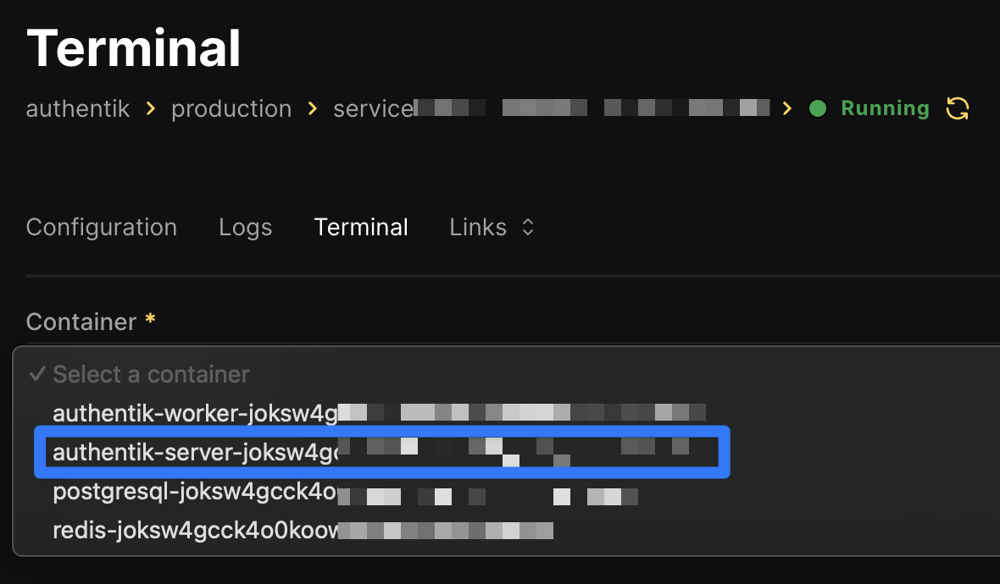
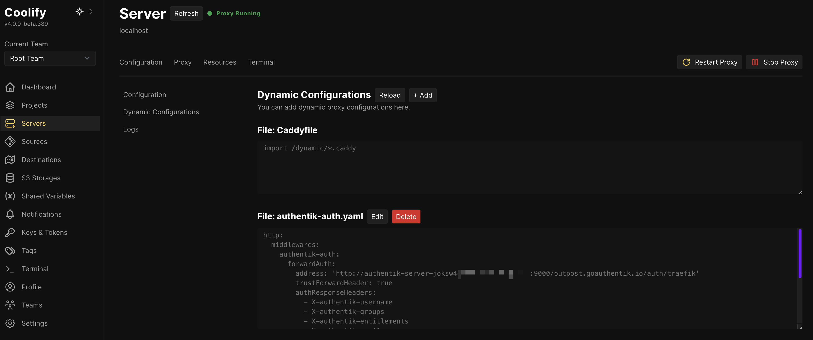
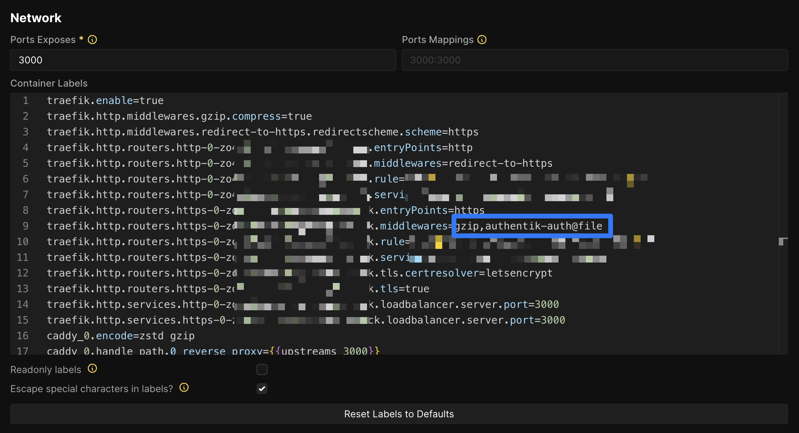

最近，我开始使用 Coolify 部署一些小应用。其中一个让我头疼的问题是如何为这些应用添加认证功能。

我首先尝试了 [Basic Auth 中间件]。它确实能完成任务，但用户体验并不友好。我需要为每个应用创建新的用户名和密码，管理起来非常麻烦。

后来，我在查看 [Authentik] 时，注意到它有一个 Forward Auth 功能，这对我来说是一个很好的选择。

说实话，[Authentik 文档] 和 [Coolify 文档] 已经解释得很清楚了。但由于我是 Traefik 和 Forward Auth 的新手，文档对我来说不够清晰，我花了很多时间才弄明白如何让它正常工作。因此，我决定写下这篇指南，帮助其他遇到同样问题的人。

## 部署 Authentik 服务

第一步是部署 [Authentik 服务]。截至 2025 年 1 月 28 日，Coolify 仓库中的官方 [Authentik 模板] 并没有暴露端口（参见 [这个问题]）。因此，它无法直接使用。你需要修改模板以暴露端口。将模板复制到你喜欢的文本编辑器中，并在 `services.authentik-server.image` 下方添加 `ports`，修改后的内容如下：

```yaml
services:
  authentik-server:
    image: ghcr.io/goauthentik/server:${AUTHENTIK_TAG:-2024.12.2}
    ports:
      - "9000:9000"
...
```

然后，使用修改后的模板部署 Authentik 服务。选择 `Docker Compose Empty` 并粘贴修改后的模板。

Authentik 服务启动后，访问 `http://<你的服务器 IP 或主机名>:9000/if/flow/initial-setup/` 进行初始设置。

## 创建应用和 Proxy Provider

接下来，在 Authentik 中创建一个应用。你可以跟着 [这个视频]（从 9:40 开始到 11:40 结束）来创建一个带有 Forward Auth 的应用。

根据你的需求，你可以选择 `Forward auth (single application)` 或 `Forward auth (domain level)`。由于我的应用运行在多个域名上，我选择了 `Forward auth (single application)`。

## 创建 Traefik 配置

在你刚刚创建的 provider 中，Authentik 提供了几种不同代理的配置。然而，这些配置都不适用于 Coolify 中的 Traefik。现在，让我们回到 [Coolify 文档] 继续操作。

### 查找 Authentik 服务器主机

我们需要找到 Authentik 服务器的主机。在 Coolify 中找到 Authentik 服务，进入 `Terminal` 标签页。展开 `Container` 下拉菜单，带有 `server` 键的那个就是 Authentik 服务器主机。



从源代码或开发者工具面板中复制它（不要手动输入），并保存到你喜欢的笔记工具中。

### 创建动态配置文件

进入 `Servers`（左侧面板）> `localhost` > `Proxy` 标签页 > `Dynamic Configurations`。添加一个新的动态配置。将文件名设置为 `authentik-auth.yaml`，并粘贴以下内容：

```yaml
http:
  middlewares:
    authentik-auth:
      forwardAuth:
        address: 'http://AUTHENTIK_SERVER_HOST:9000/outpost.goauthentik.io/auth/traefik'
        trustForwardHeader: true
        authResponseHeaders:
          - X-authentik-username
          - X-authentik-groups
          - X-authentik-entitlements
          - X-authentik-email
          - X-authentik-name
          - X-authentik-uid
          - X-authentik-jwt
          - X-authentik-meta-jwks
          - X-authentik-meta-outpost
          - X-authentik-meta-provider
          - X-authentik-meta-app
          - X-authentik-meta-version
```

将 `AUTHENTIK_SERVER_HOST` 替换为你之前保存的 Authentik 服务器主机。然后点击 `Save`。



## 保护服务

最后，进入你想要保护的服务/应用。在 `Configuration` > `General` > `Network` 中，首先取消勾选 `Readonly labels`，然后在 `Container Labels` 下找到标签 `traefik.http.routers.https-0-XXXXXXX.middlewares`（XXXXXXX 部分每个服务都不同）。在值中添加 `authentik-auth@file`。



保存更改，重新部署服务，然后访问它。你应该会被重定向到 Authentik 登录页面。登录后，你应该能够访问该服务。

通过以上步骤，你可以将 Authentik Forward Auth 与 Coolify 集成，确保服务的安全访问。如果你有任何问题或建议，欢迎留言！

[Basic Auth 中间件]: https://coolify.io/docs/knowledge-base/traefik/basic-auth
[Authentik]: https://goauthentik.io/
[Authentik 文档]: https://docs.goauthentik.io/docs/add-secure-apps/applications/manage_apps
[Coolify 文档]: https://coolify.io/docs/knowledge-base/traefik/protecting-services-with-authentik
[Authentik 服务]: https://coolify.io/docs/services/authentik
[Authentik 模板]: https://github.com/coollabsio/coolify/blob/main/templates/compose/authentik.yaml
[这个问题]: https://github.com/coollabsio/coolify/issues/4849
[这个视频]: https://youtu.be/broUAWrIWDI?si=ULpxMvxTmQUhMlv8&t=581
